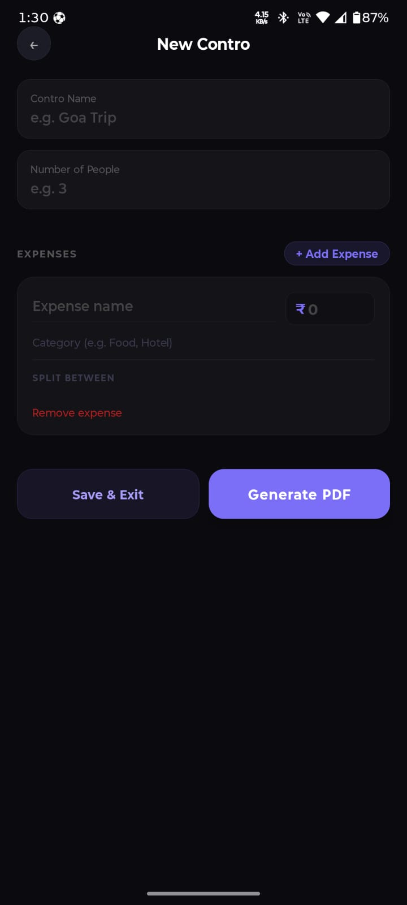
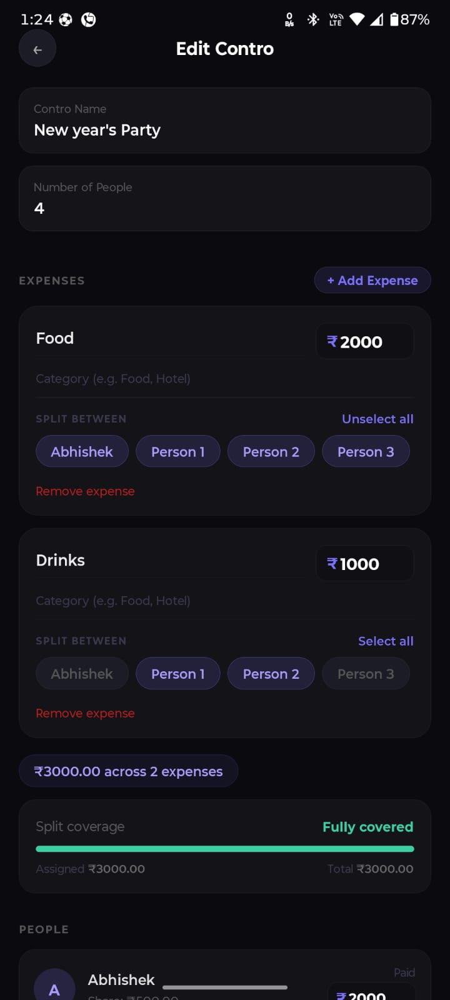
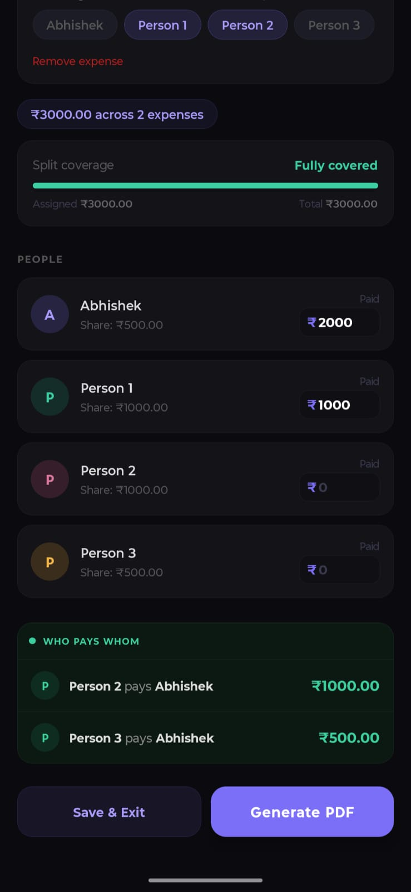
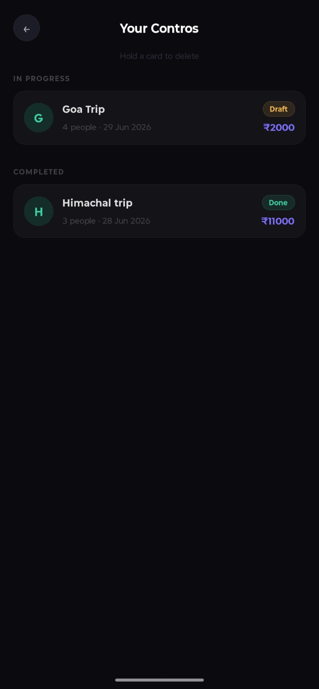
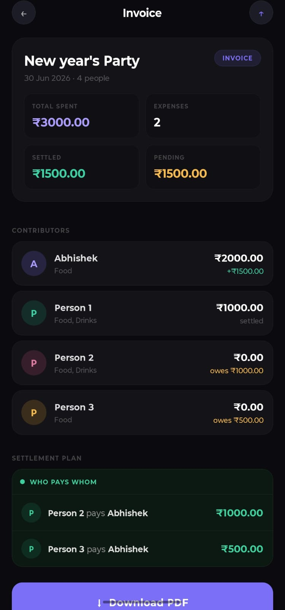
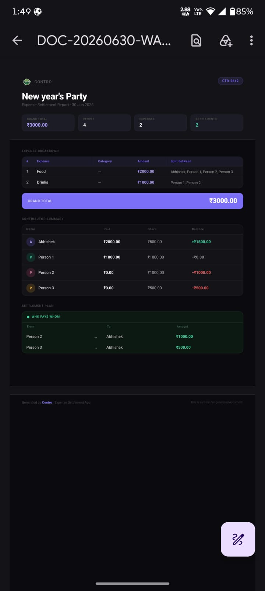

<div align="center">


# Contro

**Split group expenses. Settle faster. No accounts, no signups, no hassle.**

<p align="center">
A privacy-first expense splitting app built with React Native and Expo.
</p>

[](https://expo.dev)
[]()
[]()

<p align="center">
✨ Offline First • 🔒 Privacy Focused • 📄 PDF Export • ⚡ Zero Signup
</p>

<br/>


</div>

---

## Why Contro

Most expense-splitting apps make you sign up, log in, and add friends before you can split a single bill. Contro skips all of that.

- **No accounts.** Open the app and start splitting.
- **No backend.** Everything runs and saves locally on your device.
- **No fuss.** Add expenses as they happen, save your progress, come back to it whenever.

> **Contro = Contribution** - built for the moment a trip, dinner, or shared bill needs to be split fairly.

---

## ✨ Highlights

- 🚀 Zero onboarding – start splitting in seconds
- 🔒 100% local-first and privacy-friendly
- 💸 Optimized debt settlement algorithm
- 📄 One-tap PDF expense reports
- 📱 Clean React Native mobile experience

---

## Features

|                                          |                                                                                                                     |
| ---------------------------------------- | ------------------------------------------------------------------------------------------------------------------- |
| 🧮 **Smart settlement engine**           | Calculates the minimum number of payments needed to settle the whole group - no more "who owes who what" confusion. |
| 💾 **Save & resume anytime**             | A Contro isn't a one-shot form. Save mid-trip and keep adding expenses as they happen.                              |
| 📁 **Saved Contros, organized**          | All your Contros - in progress and completed - live in one dedicated screen.                                        |
| 📊 **Live balance tracking**             | A running coverage bar shows exactly how much of the total is assigned as you add expenses.                         |
| 🧾 **Per-expense participant selection** | Not everyone splits every cost - pick exactly who's in on each expense.                                             |
| 📄 **PDF invoice export**                | Generate a clean, structured expense report and share it with the whole group.                                      |
| 🔒 **Fully on-device**                   | Saved data never leaves your phone - no cloud, no tracking, no third-party servers.                                 |

---

## 📱 Screenshots

<div align="center">

### Create Contro Flow

<table>
<tr>
<td align="center">
<br/>
<b>Create Contro</b>
</td>
<td align="center">
<br/>
<b>Add Expenses</b>
</td>
<td align="center">
<br/>
<b>Settlement Summary</b>
</td>
</tr>
</table>

<br/>

### Saved Contros & Reports

<table>
<tr>
<td align="center">
<br/>
<b>Saved Contros</b>
</td>
<td align="center">
<br/>
<b>Invoice Summary</b>
</td>
<td align="center">
<br/>
<b>Generated PDF Report</b>
</td>
</tr>
</table>

</div>

---

## How it works

1. **Name your Contro** and add how many people are splitting
2. **Add expenses** as they happen - hotel, food, cabs, anything
3. **Pick who's in** on each expense; shares recalculate instantly
4. **Enter what each person actually paid**
5. **The settlement engine** works out exactly who owes whom
6. **Export a PDF** and share it with the group

---

## Tech Stack

- **Framework:** React Native (Expo, managed workflow)
- **Navigation:** React Navigation (Stack Navigator)
- **Local Storage:** `@react-native-async-storage/async-storage`
- **PDF Generation:** `expo-print` + `expo-sharing`
- **Image Handling:** `expo-image-manipulator`, `expo-asset`

No backend, no database server, no authentication layer - all data persists locally via AsyncStorage.

---

## Getting Started

### Prerequisites

- Node.js (LTS)
- Expo CLI / EAS CLI
- Expo Go app (for quick testing) or an Android/iOS emulator

### Installation

```bash
git clone https://github.com/Abhishekk29/contro.git
cd contro
npm install
npx expo start
```

Scan the QR code with the **Expo Go** app, or run on an emulator:

```bash
npx expo start --android
npx expo start --ios
```

### Building an APK

```bash
npm install -g eas-cli
eas login
eas build --platform android --profile preview
```

---

## Project Structure

```text
contro/
├── src/
│   ├── screens/
│   │   ├── EntryScreen.js          # Landing screen
│   │   ├── QuickControScreen.js    # Create / edit a Contro
│   │   ├── SavedControsScreen.js   # List of saved Contros
│   │   ├── InvoiceScreen.js        # Summary + PDF export
│   │   ├── AboutScreen.js          # App info
│   │   └── SplashScreen.js
│   └── utils/
│       └── controStorage.js        # AsyncStorage read/write layer
├── assets/
├── App.js                          # Navigation entry point
└── app.json
```

---

## Architecture Notes

Contro is intentionally **local-first**:

- Each Contro is stored as a JSON object in AsyncStorage, keyed under a single list
- No network calls are made for core functionality — splitting, saving, and PDF generation all work offline
- This tradeoff (no cross-device sync) was a deliberate design choice to keep the app instant-on with zero friction, in exchange for simplicity and privacy

---

## Roadmap

- [ ] Export/import Contros as backup files
- [ ] Expense categories with spend breakdown charts
- [ ] Custom (non-equal) split amounts per person
- [ ] Multi-currency support

---

## Author

**Abhishek Sharma**
React Native Developer

[](mailto:abhishekanandsharma99@gmail.com)
[](https://github.com/Abhishekk29)
[](https://linkedin.com/in/abhisheksharmaendl)

---

<div align="center">
<sub>Built with ❤️ using React Native & Expo</sub>
</div>
